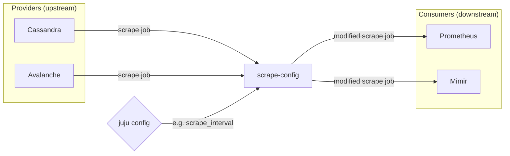

## Deployment scenarios

Generally, the prometheus config file ([example][prom-config-example])
has the following form:

| Section          | Provided by                                             |
|------------------|---------------------------------------------------------|
| `global`         | promethehus                                             |
| `rule_files`     | rules from upstream charms; re-structured by prometheus |
| `alerting`       | alertmanager                                            |
| `tracing`        | (not yet implemented)                                   |
| `scrape_configs` | upstream charms, prometheus-scrape-config               |

The `scrape_configs` section is made up of:

| Subsection        | Provided by                                                              |
|-------------------|--------------------------------------------------------------------------|
| `job_name`        | upstream charm (optional); topology-prefixed and deduped (consumer side) |
| `static_configs`  | upstream charm                                                           |
| `metrics_path`    | upstream charm                                                           |
| `relabel_configs` | upstream charm (optional); topology-adjusted (consumer side)             |
| `scrape_interval` | upstream charm, prometheus-scrape-config                                 |
| etc.              | upstream charm, prometheus-scrape-config                                 |

This charm updates some values in the `scrape_configs` section.

The `static_configs` section is made up of:

| Sub-subsection | Provided by                                              |
|----------------|----------------------------------------------------------|
| `targets`      | upstream charm (star notation expanded on consumer side) |
| `labels`       | upstream charm                                           |

[prom-config-example]: https://github.com/prometheus/prometheus/blob/release-2.37/config/testdata/conf.good.yml
